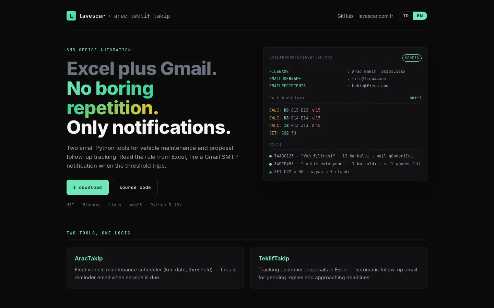
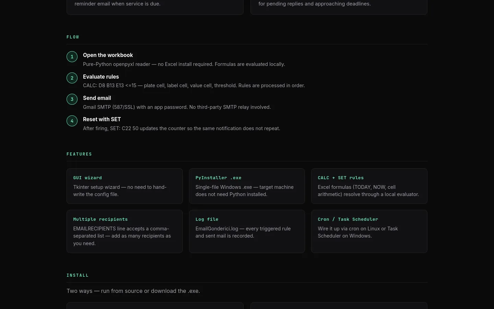
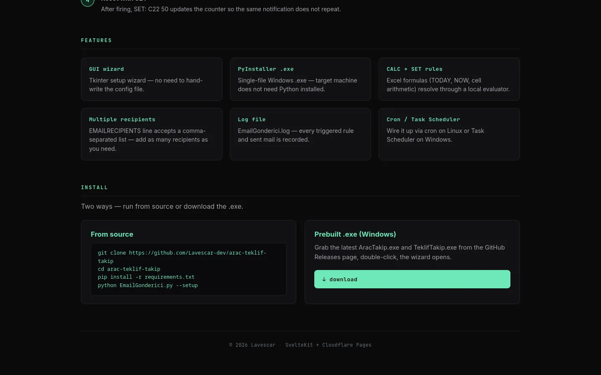

<div align="center">


# AracTakip + TeklifTakip

**Excel tabanlı bakım takibi ve teklif takip araçları için otomatik e-posta bildiri sistemi.** Excel dosyandaki muayene/sigorta tarihleri yaklaşan araçları otomatik tespit eder, ya da süresi dolan teklifleri uyarır — tek tıkla Gmail SMTP üzerinden ekibe e-posta gönderir.

[](#kurulum)
[](#mimari)
[](https://arac.lavescar.com.tr)
[](#license)

[**▸ Tanıtım sitesi**](https://arac.lavescar.com.tr) · [**▸ Portfolyo**](https://lavescar.com.tr) · [**▸ Diğer demolar**](https://lavescar.com.tr/#projects)

</div>

---

<p align="center"></p>

## Genel bakış

İki bağımsız ama ortak iskeletli desktop aracı:

- **AracTakip** — Bir Excel dosyasındaki araç bakım takvimini okur, kalan gün sayısı eşik değerinin altına indiğinde plaka, kontrol etiketi ve değeri ile otomatik e-posta gönderir. Kilometre/zaman tabanlı SET kuralları da destekler (her bildiriden sonra hücre değeri otomatik artar).
- **TeklifTakip** — Bir teklif tablosundaki "geçerlilik bitiş tarihi" sütununu izler, vade dolmasına X gün kala iletişim kişisine ve iç ekibe ayrı şablonlu e-posta gönderir.

Her iki araç da `--setup` parametresi ile **Tkinter sihirbazı** açar — son kullanıcı kod yazmadan SMTP, alıcı listesi ve hücre eşleştirmelerini ayarlayabilir.

## Özellikler

- **Excel formula evaluator** — `=TODAY()`, `=NOW()` ve `=D13-C13` gibi binary aritmetik Excel kurmadan hesaplanır
- **CALC + SET kuralları** — eşik karşılaştırması (`<=15`, `>30` vb.) ve hücre auto-increment
- **İlk çalıştırma sihirbazı** — Tkinter UI, mevcut ayarları okur, formu önceden doldurur, geri yazar
- **Domain kurallarını koru** — sihirbaz CALC/SET bloklarına dokunmaz
- **Gmail SMTP** — App Password ile authenticate, TLS
- **Argparse CLI** — `--setup`, `--config`, `--debug` flag'leri
- **PyInstaller .exe** — son kullanıcıya tek `.exe` dosyası gönderilebilir, Python kurulumu gerekmez

## Mimari

| Bileşen | Teknoloji |
|---|---|
| GUI | Tkinter (Python stdlib) |
| Excel I/O | openpyxl |
| E-posta | Python `smtplib` + Gmail SMTP (TLS, App Password) |
| Config | Düz metin `.txt` (key:value, CALC/SET kural blokları) |
| Build | PyInstaller (Windows `.exe` tek dosya) |

## Ekran görüntüleri

<table>
  <tr>
    <td></td>
    <td></td>
  </tr>
</table>

## Hızlı başlangıç

### Python ile

```bash
git clone https://github.com/Lavescar-dev/arac-teklif-takip.git
cd arac-teklif-takip

python -m venv .venv
source .venv/bin/activate    # Windows: .venv\Scripts\activate
pip install -r requirements.txt

# İlk kurulum sihirbazı
python EmailGonderici.py --setup

# Gerçek çalıştırma (config oluştuktan sonra)
python EmailGonderici.py
```

`TeklifTakipEmailGonderici.py` aynı arayüze sahiptir.

### .exe ile (Windows son kullanıcı)

[Releases](https://github.com/Lavescar-dev/arac-teklif-takip/releases) sayfasından `EmailGonderici.exe` veya `TeklifTakipEmailGonderici.exe` indir.

```cmd
:: İlk kurulum sihirbazı
EmailGonderici.exe --setup

:: Zamanlanmış görev (Görev Zamanlayıcı her gün 09:00)
schtasks /create /tn "AracTakip" /tr "C:\Path\EmailGonderici.exe" /sc daily /st 09:00
```

## Config formatı

```ini
FILENAME: Arac Bakim Takibi.xlsx
GMAILUSERNAME: ornek@gmail.com
GMAILPASSWORD: <gmail_app_password>
EMAILRECIPIENTS: ornek1@firma.com, ornek2@firma.com

# CALC: <plaka_hücresi> <etiket_hücresi> <değer_hücresi> <op><eşik>
CALC: D8 B13 E13 <=15
CALC: D8 B14 E14 <=15

# SET: <hücre> <artış_değeri>  (her bildirimde hücre değeri += artış)
SET: C22 50
```

> **Gmail App Password gerekli.** Normal hesap şifresi 2024'ten itibaren SMTP'ye izin vermez. [App Password oluşturma](https://myaccount.google.com/apppasswords).

## PyInstaller ile build

```bash
pip install pyinstaller

# Tek-dosya, konsolsuz build (Windows)
pyinstaller --onefile --noconsole \
  --name "EmailGonderici" \
  --add-data "EmailGondericiAyarlar.example.txt;." \
  EmailGonderici.py

# TeklifTakip için
pyinstaller --onefile --noconsole \
  --name "TeklifTakipEmailGonderici" \
  --add-data "TeklifTakipAyarlar.example.txt;." \
  TeklifTakipEmailGonderici.py
```

`dist/*.exe` çıktısı son kullanıcıya tek dosya halinde gönderilir.

## Çalıştırma matrisi

| Komut | Davranış |
|---|---|
| `EmailGonderici.exe` | Excel'i okur, eşikleri kontrol eder, gerekirse e-posta atar |
| `EmailGonderici.exe --setup` | Tkinter sihirbazını açar (config düzenle) |
| `EmailGonderici.exe --config alt.txt` | Alternatif config dosyası |
| `EmailGonderici.exe --debug` | Verbose log + e-posta göndermeden test |

## License

MIT © 2026 Lavescar

---

<sub>Built by **[Lavescar](https://lavescar.com.tr)** · [Portfolyo](https://lavescar.com.tr/#projects) · [efe@lavescar.com.tr](mailto:efe@lavescar.com.tr)</sub>
